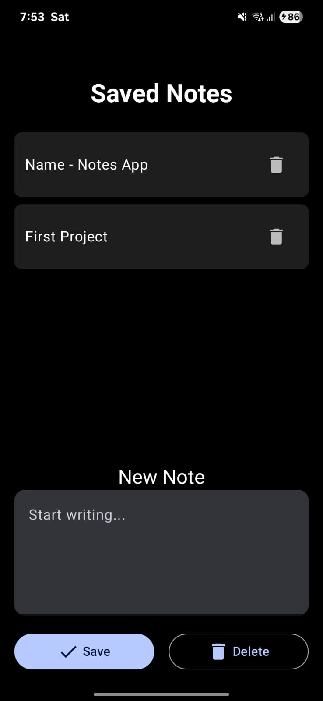
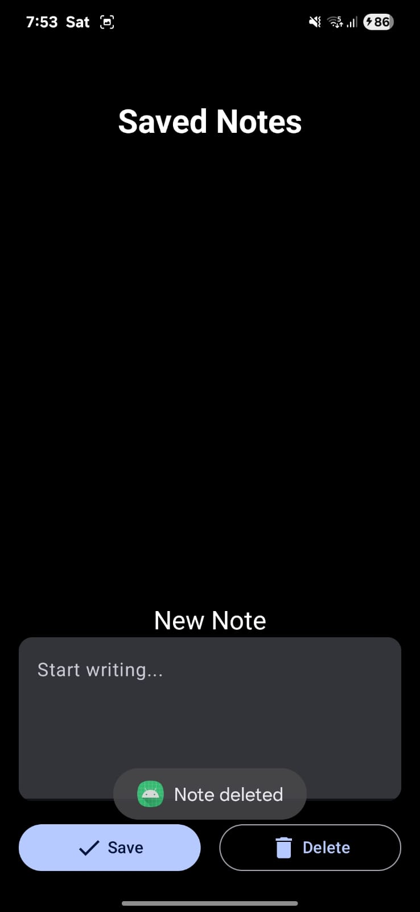

# Simple Notes App 📝

A simple, local note-taking application for Android, built with Kotlin and Jetpack Compose. This project serves as a great introduction to modern Android development, covering UI, state management, and local file persistence.

## ✨ Features

* **Create Notes:** An easy-to-use input field to write and save new notes.
* **View All Notes:** All saved notes are displayed in a clean, scrollable list.
* **Persistent Storage:** Notes are saved directly on the device's internal storage, so they persist even after the app is closed.
* **Delete Notes:** Easily remove notes you no longer need.
* **Dark Theme:** A sleek, modern dark UI.

## 📸 Screenshots

Here's what the app looks like.

| Notes List | Empty State |
| :---: | :---: |
|  |  |

*To add your own screenshots, take a screenshot from the emulator, drag it into your project's root folder in Android Studio, commit and push it, and then update the `src=""` path.*

## 🛠️ Built With

This project is built using the latest technologies in the Android ecosystem:

* **[Kotlin](https://kotlinlang.org/):** The primary programming language.
* **[Jetpack Compose](https://developer.android.com/jetpack/compose):** Android's modern, declarative UI toolkit.
* **[Material Design 3](https://m3.material.io/):** The latest design system for building beautiful, modern UIs.
* **[Android Studio](https://developer.android.com/studio):** The official IDE for Android development.

## 🚀 Getting Started

To get a local copy up and running, follow these simple steps.

1.  **Clone the repository:**
    ```sh
    git clone https://github.com/Icey067/Android-Notes-App/
    ```
2.  **Open in Android Studio:**
    * Open Android Studio.
    * Select `File > Open` and navigate to the cloned project folder.
    * Let Android Studio sync the Gradle files, and then run the app on an emulator or a physical device.

## 📄 License

Distributed under the MIT License. See `LICENSE` file for more information.
